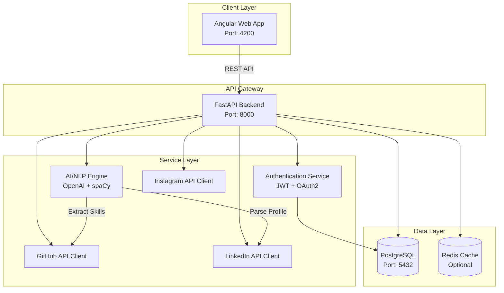
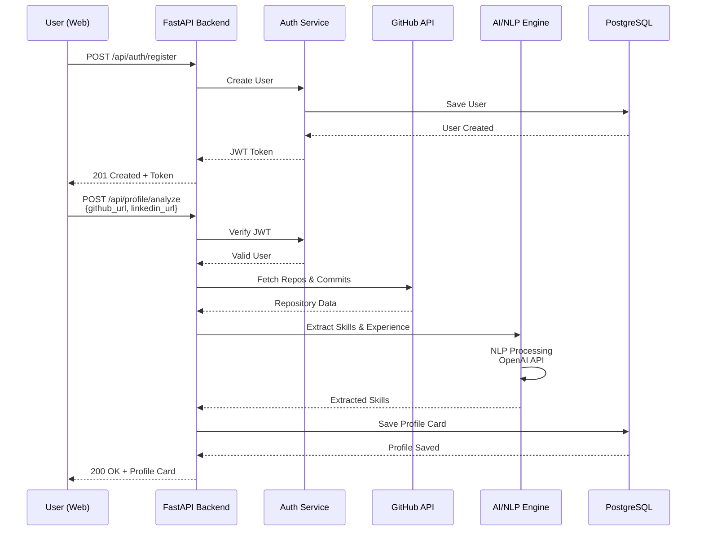

# Mimariye Genel Bakış

<details open>
<summary><strong>🇹🇷 Türkçe</strong></summary>

<br>

Bu sayfa, SkillCard projesinin yüksek seviyeli mimarisini, ana bileşenlerini ve bu bileşenlerin birbiriyle olan ilişkilerini açıklamaktadır.

---

## Ana Bileşenler

### Frontend (Angular 20 + TailwindCSS)
- **Teknoloji:** Angular 20, TailwindCSS, RxJS, Signals
- **Sorumluluklar:**
  - Kullanıcı arayüzü ve etkileşim
  - Profil kartı görselleştirme
  - Dashboard ve filtreleme arayüzü
  - Responsive design (web)
- **Port:** `http://localhost:4200`

### Backend API (Python + FastAPI)
- **Teknoloji:** FastAPI, SQLAlchemy, Pydantic
- **Sorumluluklar:**
  - RESTful API endpoints
  - Business logic ve veri validasyonu
  - GitHub/LinkedIn/Instagram API entegrasyonları
  - Database işlemleri (CRUD)
  - Authentication & Authorization (JWT)
- **Port:** `http://localhost:8000`
- **API Docs:** `http://localhost:8000/docs` (Swagger UI)

### AI/NLP Servisi (Python AI Engine)
- **Teknoloji:** OpenAI API, spaCy, Transformers, Langchain
- **Sorumluluklar:**
  - GitHub repo analizi ve beceri çıkarımı
  - LinkedIn profil parsing ve NLP
  - OpenAI GPT ile profil özeti oluşturma
  - Beceri skorlama ve kategorilendirme
- **Entegrasyon:** Backend API'den internal fonksiyon çağrısı

### Database (PostgreSQL)
- **Teknoloji:** PostgreSQL 16
- **Sorumluluklar:**
  - Kullanıcı profilleri
  - Sosyal medya verileri cache
  - Profil kartları metadata
  - Authentication tokens
- **Port:** `localhost:5432`

### Authentication Service (JWT + OAuth 2.0)
- **Teknoloji:** FastAPI Security, PyJWT, OAuth2
- **Sorumluluklar:**
  - Kullanıcı kayıt ve giriş
  - JWT token yönetimi
  - GitHub/LinkedIn OAuth entegrasyonu
  - Role-based access control (RBAC)

---

## Sistem Mimarisi Şeması


---

## Veri Akışı

### Senaryo 1: Kullanıcı Profil Oluşturma


### Senaryo 2: Profil Kartı Görüntüleme
```
User → Frontend → API → Database → API → Frontend → User
  1. Kullanıcı profil kartına tıklar
  2. Frontend API'ye GET /api/profiles/{id} isteği gönderir
  3. API database'den profil kartını çeker
  4. Frontend kartı görselleştirir
```

### Senaryo 3: Akıllı Arama/Filtreleme
```
User → Frontend → API → Database → AI (Optional) → API → Frontend → User
  1. Kullanıcı "Python developer" arar
  2. API database'de full-text search yapar
  3. AI servisi sonuçları relevance'a göre sıralar
  4. Frontend sonuçları listeler
```

---

## Teknolojiler ve Gerekçeleri

### Backend: Python + FastAPI

**Neden seçildi:**
- OpenAI resmi SDK native Python desteği
- NLP kütüphaneleri (spaCy, NLTK, Transformers) Python'da güçlü
- Async/await desteği (performans)
- Otomatik API dokümantasyonu (Swagger/OpenAPI)
- Type hints ile type safety (Pydantic)
- Hızlı prototipleme ve geliştirme
- AI/ML ekosistemi zengin

**Dezavantajları:**
- Java kadar strict type system yok
- Thread-based concurrency sınırlı (GIL)

**Alternatifler:** Java Spring Boot, Node.js Express  
**Karar:** AI/NLP odaklı proje olduğu için Python optimal seçim

---

### Frontend: Angular 20

**Neden seçildi:**
- Enterprise-grade framework
- Strong typing (TypeScript)
- Modern reactive programming (Signals)
- Built-in form validation, routing, HTTP client
- TailwindCSS ile hızlı UI geliştirme
- Component-based architecture

**Dezavantajları:**
- Öğrenim eğrisi React'tan daha dik
- Bundle size biraz daha büyük

**Alternatifler:** React, Vue.js, Svelte  
**Karar:** Type safety, enterprise patterns ve Angular 20'nin modern özellikleri

---

### Database: PostgreSQL

**Neden seçildi:**
- Open source ve güvenilir
- JSONB desteği (flexible schema)
- Full-text search (profil araması için kritik)
- Complex queries ve indexing
- ACID compliance
- SQLAlchemy ORM ile mükemmel entegrasyon

**Dezavantajları:**
- NoSQL kadar flexible değil

**Alternatifler:** MongoDB, MySQL, SQLite  
**Karar:** Structured data + full-text search ihtiyacı için ideal

---

### AI/ML: OpenAI API + spaCy

**Neden seçildi:**
- OpenAI GPT-4: En gelişmiş NLP modeli
- spaCy: Hızlı ve production-ready NLP
- Langchain: LLM orchestration
- Transformers: Hugging Face modelleri

**Dezavantajları:**
- OpenAI API maliyeti (rate limiting gerekli)
- External dependency

**Alternatifler:** Self-hosted LLM, Claude API, Gemini  
**Karar:** OpenAI industry standard ve en iyi sonuçlar

---

### Authentication: JWT + OAuth 2.0

**Neden seçildi:**
- Stateless authentication (scalable)
- OAuth 2.0 industry standard
- GitHub/LinkedIn login entegrasyonu kolay
- JWT token'lar lightweight

**Dezavantajları:**
- Token revocation kompleks olabilir

**Alternatifler:** Session-based auth, Auth0, Keycloak  
**Karar:** Basit, standart, cost-effective

---

## Güvenlik Mimarisi

### Authentication Flow
```
1. User → Login with GitHub/LinkedIn
2. OAuth Provider → Authorization Code
3. Backend → Exchange code for access token
4. Backend → Create JWT token
5. Frontend → Store JWT in httpOnly cookie
6. Subsequent requests → JWT in Authorization header
```

### Data Security
- Password hashing: bcrypt
- HTTPS only (TLS/SSL)
- Rate limiting: 100 requests/hour per user
- Input validation: Pydantic models
- SQL injection prevention: SQLAlchemy ORM
- CORS policy: Whitelisted domains
- API key rotation: Monthly

---

## Performans ve Scalability

### Caching Strategy
```python
# Redis cache for GitHub API responses
@cache(ttl=3600)  # 1 hour
async def fetch_github_repos(username: str):
    # Expensive API call
    pass
```

### Database Indexing
```sql
-- Full-text search index
CREATE INDEX idx_profile_skills ON profiles 
USING GIN (to_tsvector('english', skills));

-- User lookup index
CREATE INDEX idx_users_email ON users (email);
```

### API Rate Limiting
```python
from slowapi import Limiter

limiter = Limiter(key_func=get_remote_address)

@app.get("/api/profiles")
@limiter.limit("10/minute")
async def list_profiles():
    pass
```

---

## API Endpoint Yapısı

### Authentication
```
POST   /api/auth/register
POST   /api/auth/login
POST   /api/auth/logout
POST   /api/auth/refresh
GET    /api/auth/me
```

### Profiles
```
POST   /api/profiles/analyze    # Create profile from social media
GET    /api/profiles            # List all profiles (with filters)
GET    /api/profiles/{id}       # Get single profile
PUT    /api/profiles/{id}       # Update profile
DELETE /api/profiles/{id}       # Delete profile
```

### Skills
```
GET    /api/skills              # List all skills
GET    /api/skills/trending     # Trending skills
```

### Search
```
GET    /api/search?q=python&skills=django,fastapi
```

---

## Kaynaklar

- [FastAPI Documentation](https://fastapi.tiangolo.com/)
- [Angular Documentation](https://angular.io/docs)
- [PostgreSQL Documentation](https://www.postgresql.org/docs/)
- [OpenAI API Reference](https://platform.openai.com/docs)

---

</details>

<details>
<summary><strong>🇬🇧 English</strong></summary>

<br>

This page describes the high-level architecture of the SkillCard project, its main components, and the relationships between these components.

---

## Main Components

### Frontend (Angular 20 + TailwindCSS)
- **Technology:** Angular 20, TailwindCSS, RxJS, Signals
- **Responsibilities:**
  - User interface and interaction
  - Profile card visualization
  - Dashboard and filtering interface
  - Responsive design (web)
- **Port:** `http://localhost:4200`

### Backend API (Python + FastAPI)
- **Technology:** FastAPI, SQLAlchemy, Pydantic
- **Responsibilities:**
  - RESTful API endpoints
  - Business logic and data validation
  - GitHub/LinkedIn/Instagram API integrations
  - Database operations (CRUD)
  - Authentication & Authorization (JWT)
- **Port:** `http://localhost:8000`
- **API Docs:** `http://localhost:8000/docs` (Swagger UI)

### AI/NLP Service (Python AI Engine)
- **Technology:** OpenAI API, spaCy, Transformers, Langchain
- **Responsibilities:**
  - GitHub repository analysis and skill extraction
  - LinkedIn profile parsing and NLP
  - Profile summary generation using OpenAI GPT
  - Skill scoring and categorization
- **Integration:** Internal function call from Backend API

### Database (PostgreSQL)
- **Technology:** PostgreSQL 16
- **Responsibilities:**
  - User profiles
  - Cached social media data
  - Profile card metadata
  - Authentication tokens
- **Port:** `localhost:5432`

### Authentication Service (JWT + OAuth 2.0)
- **Technology:** FastAPI Security, PyJWT, OAuth2
- **Responsibilities:**
  - User registration and login
  - JWT token management
  - GitHub/LinkedIn OAuth integration
  - Role-based access control (RBAC)

---

## System Architecture Diagram


---

## Data Flow

### Scenario 1: User Profile Creation


### Scenario 2: Viewing a Profile Card
```
User → Frontend → API → Database → API → Frontend → User
  1. User clicks on a profile card
  2. Frontend sends GET /api/profiles/{id} request to API
  3. API fetches profile card from database
  4. Frontend visualizes the card
```

### Scenario 3: Smart Search/Filtering
```
User → Frontend → API → Database → AI (Optional) → API → Frontend → User
  1. User searches for "Python developer"
  2. API performs full-text search in database
  3. AI service ranks results by relevance
  4. Frontend lists results
```

---

## Technologies and Rationale

### Backend: Python + FastAPI

**Why it was chosen:**
- Official OpenAI SDK with native Python support
- Strong NLP libraries (spaCy, NLTK, Transformers) in Python
- Async/await support (performance)
- Automatic API documentation (Swagger/OpenAPI)
- Type safety with type hints (Pydantic)
- Fast prototyping and development
- Rich AI/ML ecosystem

**Disadvantages:**
- Not as strict type system as Java
- Limited thread-based concurrency (GIL)

**Alternatives:** Java Spring Boot, Node.js Express  
**Decision:** Python is the optimal choice for AI/NLP-focused projects

---

### Frontend: Angular 20

**Why it was chosen:**
- Enterprise-grade framework
- Strong typing (TypeScript)
- Modern reactive programming (Signals)
- Built-in form validation, routing, HTTP client
- Fast UI development with TailwindCSS
- Component-based architecture

**Disadvantages:**
- Steeper learning curve than React
- Slightly larger bundle size

**Alternatives:** React, Vue.js, Svelte  
**Decision:** Type safety, enterprise patterns, and Angular 20's modern features

---

### Database: PostgreSQL

**Why it was chosen:**
- Open source and reliable
- JSONB support (flexible schema)
- Full-text search (critical for profile search)
- Complex queries and indexing
- ACID compliance
- Excellent integration with SQLAlchemy ORM

**Disadvantages:**
- Not as flexible as NoSQL

**Alternatives:** MongoDB, MySQL, SQLite  
**Decision:** Ideal for structured data + full-text search requirements

---

### AI/ML: OpenAI API + spaCy

**Why it was chosen:**
- OpenAI GPT-4: Most advanced NLP model
- spaCy: Fast and production-ready NLP
- Langchain: LLM orchestration
- Transformers: Hugging Face models

**Disadvantages:**
- OpenAI API costs (rate limiting required)
- External dependency

**Alternatives:** Self-hosted LLM, Claude API, Gemini  
**Decision:** OpenAI is industry standard with best results

---

### Authentication: JWT + OAuth 2.0

**Why it was chosen:**
- Stateless authentication (scalable)
- OAuth 2.0 industry standard
- Easy GitHub/LinkedIn login integration
- Lightweight JWT tokens

**Disadvantages:**
- Token revocation can be complex

**Alternatives:** Session-based auth, Auth0, Keycloak  
**Decision:** Simple, standard, cost-effective

---

## 🔒 Security Architecture

### Authentication Flow
```
1. User → Login with GitHub/LinkedIn
2. OAuth Provider → Authorization Code
3. Backend → Exchange code for access token
4. Backend → Create JWT token
5. Frontend → Store JWT in httpOnly cookie
6. Subsequent requests → JWT in Authorization header
```

### Data Security
- Password hashing: bcrypt
- HTTPS only (TLS/SSL)
- Rate limiting: 100 requests/hour per user
- Input validation: Pydantic models
- SQL injection prevention: SQLAlchemy ORM
- CORS policy: Whitelisted domains
- API key rotation: Monthly

---

## Performance and Scalability

### Caching Strategy
```python
# Redis cache for GitHub API responses
@cache(ttl=3600)  # 1 hour
async def fetch_github_repos(username: str):
    # Expensive API call
    pass
```

### Database Indexing
```sql
-- Full-text search index
CREATE INDEX idx_profile_skills ON profiles 
USING GIN (to_tsvector('english', skills));

-- User lookup index
CREATE INDEX idx_users_email ON users (email);
```

### API Rate Limiting
```python
from slowapi import Limiter

limiter = Limiter(key_func=get_remote_address)

@app.get("/api/profiles")
@limiter.limit("10/minute")
async def list_profiles():
    pass
```

---

## API Endpoint Structure

### Authentication
```
POST   /api/auth/register
POST   /api/auth/login
POST   /api/auth/logout
POST   /api/auth/refresh
GET    /api/auth/me
```

### Profiles
```
POST   /api/profiles/analyze    # Create profile from social media
GET    /api/profiles            # List all profiles (with filters)
GET    /api/profiles/{id}       # Get single profile
PUT    /api/profiles/{id}       # Update profile
DELETE /api/profiles/{id}       # Delete profile
```

### Skills
```
GET    /api/skills              # List all skills
GET    /api/skills/trending     # Trending skills
```

### Search
```
GET    /api/search?q=python&skills=django,fastapi
```

---

## Resources

- [FastAPI Documentation](https://fastapi.tiangolo.com/)
- [Angular Documentation](https://angular.io/docs)
- [PostgreSQL Documentation](https://www.postgresql.org/docs/)
- [OpenAI API Reference](https://platform.openai.com/docs)

---

</details>
